# FinDocGPT — From Financial Docs to Decisions (Stage 1–3)

**An AkashX.ai Hackathon Project**

Turn unstructured financial documents and market data into **actionable** buy/sell decisions. This project integrates document analysis, time-series forecasting, and a strategic decision layer into a single, user-friendly application.

- **Stage 1 – Insights & Analysis:** Upload PDFs → RAG Q&A → Sentiment Analysis → Anomaly Detection
- **Stage 2 – Forecasting:** Yahoo Finance History → Prophet + LSTM + XGBoost → Ensemble Forecast
- **Stage 3 – Strategy:** Generate BUY/SELL/HOLD signals with confidence, holding period, and an interactive Plotly dashboard.

---

## Table of Contents
- [Demo Screenshots](#demo-screenshots)
- [What We Built](#what-we-built)
- [Architecture](#architecture)
- [Project Structure](#project-structure)
- [Quickstart Guide](#quickstart-guide)
- [How It Works (In-Depth)](#how-it-works-in-depth)
- [Configuration](#configuration)
- [API Endpoints](#api-endpoints)
- [Troubleshooting](#troubleshooting)
- [Tech Stack](#tech-stack)
- [License](#license)
- [Acknowledgments](#acknowledgments)

---

## Demo Screenshots
> **Note:** Place your UI images in the `screenshots/` directory, named from `1.png` to `12.png`. They will automatically appear below.

| Feature | Screenshot Preview |
| :--- | :---: |
| **1. Home / Health Check** | 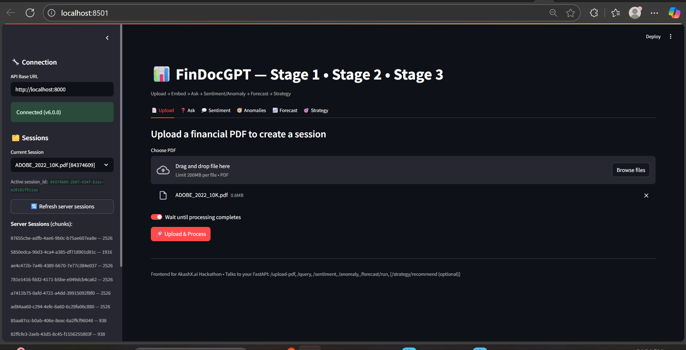 |
| **2. PDF Upload (Stage 1)** | 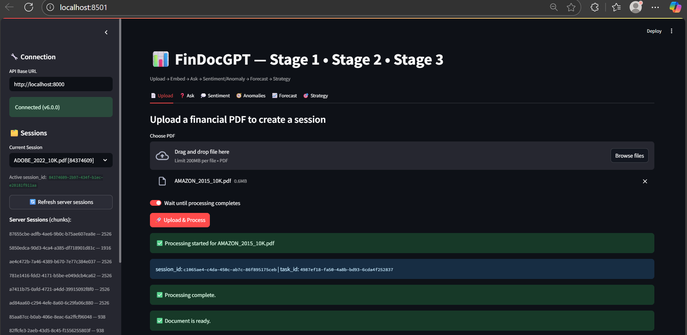 |
| **3. Document Processing Status** | 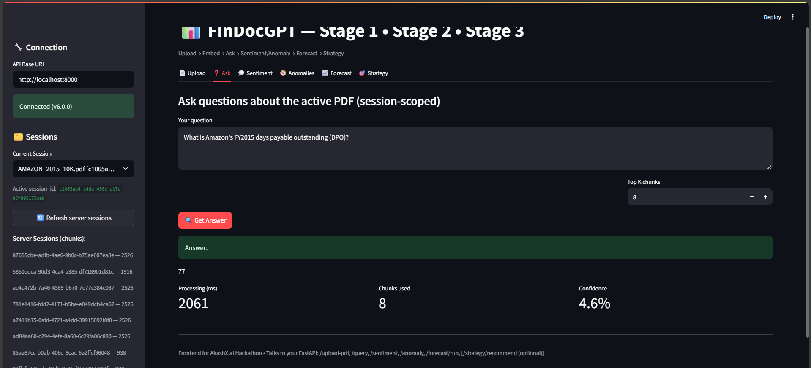 |
| **4. Q&A Over PDF Chunks** | 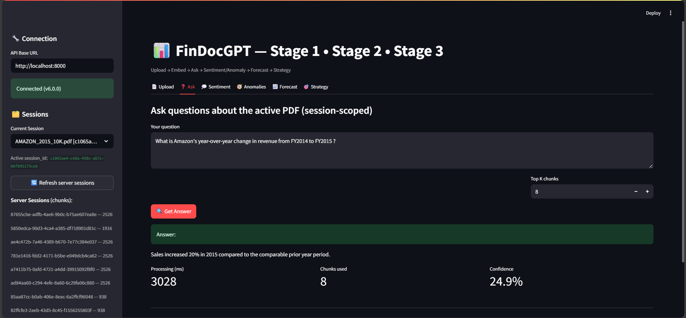 |
| **5. Sentiment Analysis** | 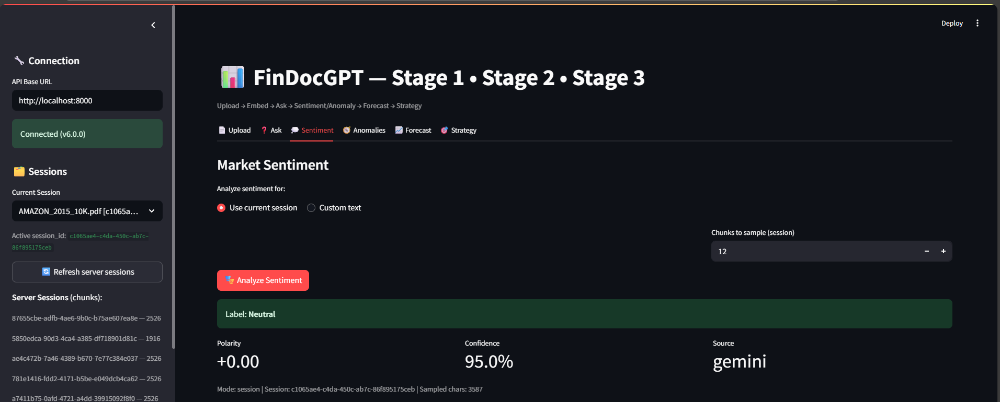 |
| **6. Anomaly Detection (YoY/Margins)** | 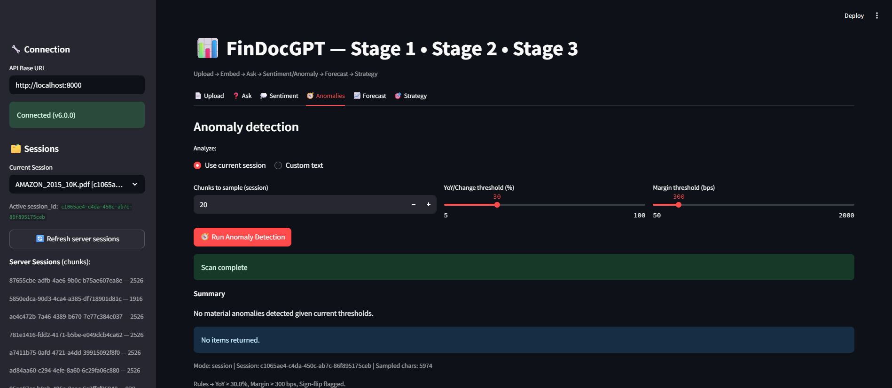 |
| **7. Forecasting Inputs (Stage 2)** | 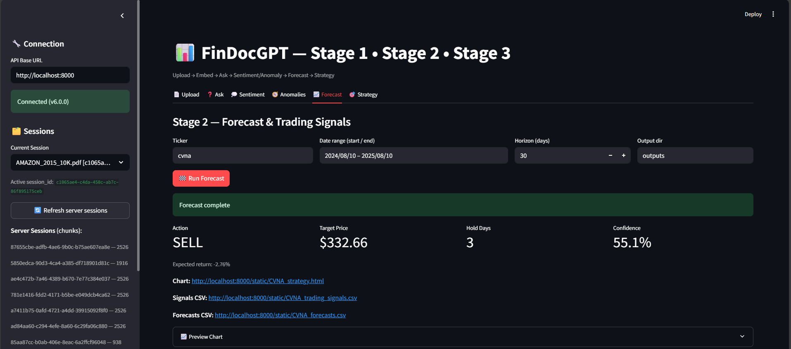 |
| **8. Strategy Chart: Price + Ensemble** | 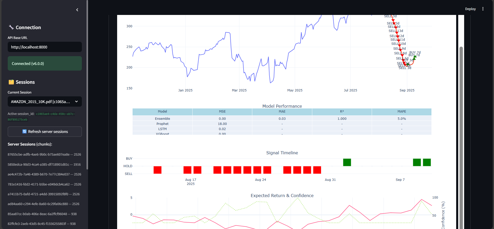 |
| **9. Signal Timeline (BUY/HOLD/SELL)** | 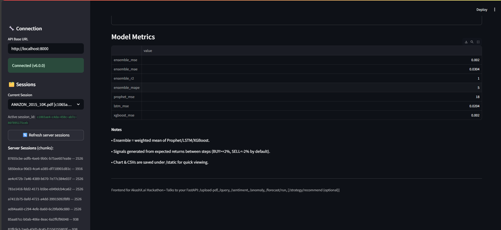 |
| **10. Expected Return & Confidence** | 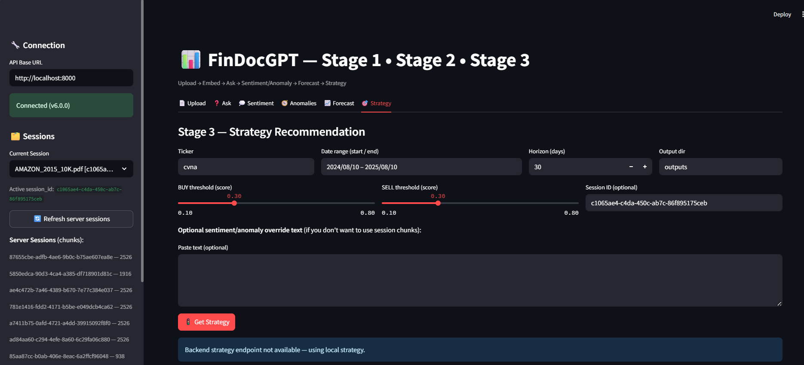 |
| **11. Model Performance Metrics** | 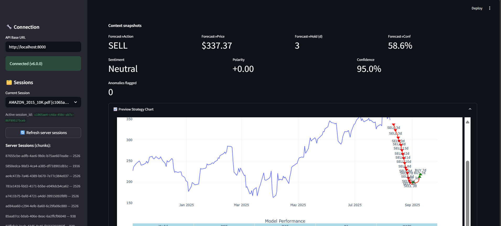 |
| **12. Downloads & Embedded Chart** | 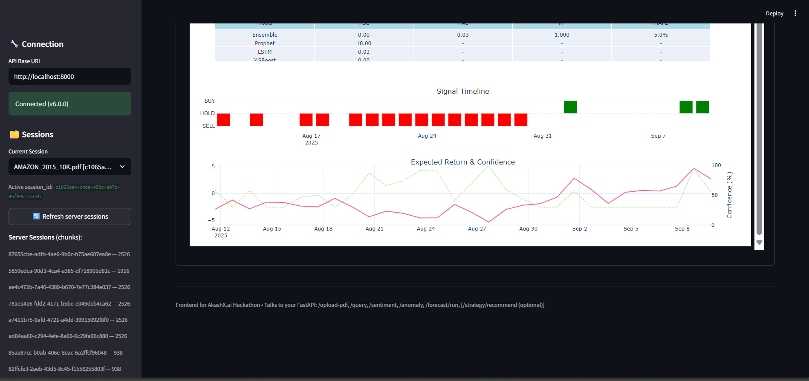 |

---

## What We Built

**The Problem:** Financial analysts spend excessive time manually parsing dense financial reports (like 10-Ks), correlating them with market data, and then translating these fragmented insights into trading decisions.

**Our Solution:** FinDocGPT is an end-to-end system that automates this workflow. It ingests unstructured PDFs, performs deep analysis, forecasts future price movements using an ensemble of ML models, and generates clear, data-backed **BUY/SELL/HOLD** recommendations.

**Key Features:**
- **Unified Workflow:** From raw document to final trade decision in a single, intuitive interface.
- **Advanced RAG:** Fast, accurate, and context-aware Q&A on financial documents using a persistent vector store.
- **Ensemble Forecasting:** Combines the strengths of Prophet, LSTM, and XGBoost for more robust price predictions.
- **Actionable Strategy Layer:** Translates forecasts into practical trading signals with confidence scores and recommended holding periods.

---

## Architecture

- **Frontend:** **Streamlit** (`FDocgpt_streamLit.py`) provides the interactive user interface.
- **Backend:** **FastAPI** (`FDocgpt_backend.py`) serves the core logic via a REST API.
- **RAG & Vector Store:** **ChromaDB** for persistent, efficient semantic search, using **Sentence-Transformers** for embeddings.
- **LLM Integration:** **Gemini** for structured data extraction (sentiment, anomalies) in JSON format.
- **Forecasting Models:** **Prophet** (for trend/seasonality), **Keras/TensorFlow LSTM** (for sequence modeling), and **XGBoost** (for feature-driven prediction).
- **Data Serving:** Static assets like Plotly charts (`.html`) and data exports (`.csv`) are served from the `/outputs` directory.

---

## Project Structure
Your repository should look like this to ensure all paths work correctly.

```
/FinDocGPT
├─ FDocgpt_backend.py      # FastAPI backend logic (Stages 1–3)
├─ FDocgpt_streamLit.py    # Streamlit frontend UI
├─ requirements.txt        # Project dependencies
├─ .env                    # Environment variables (e.g., API keys)
├─ db/                     # ChromaDB persistent vector store
├─ outputs/                # Generated Plotly charts and CSVs
├─ temp_files/             # Temporary storage for uploaded PDFs
└─ screenshots/            # Directory for UI images (1.png, 2.png, etc.)
```

---

## Quickstart Guide

### 1. Set Up Python Environment
We recommend using Python 3.10.

```bash
# Create and activate a virtual environment
python -m venv venv
# On Windows:
# venv\Scripts\activate
# On macOS/Linux:
source venv/bin/activate

# Install dependencies
pip install -r requirements.txt
```

### 2. Configure Environment Variables
Create a `.env` file in the root directory and add your API key:

```.env
GEMINI_API_KEY="YOUR_GOOGLE_AI_STUDIO_KEY"
```

Set the Keras backend. This is crucial for model compatibility.

```bash
# On Windows (in PowerShell)
$env:KERAS_BACKEND="tensorflow"

# On macOS/Linux
export KERAS_BACKEND="tensorflow"
```

### 3. Run the Backend Server
The FastAPI backend serves the core logic and models.

```bash
uvicorn FDocgpt_backend:app --reload --port 8000
```
Check if it's running by visiting [http://localhost:8000](http://localhost:8000) in your browser.

### 4. Run the Frontend Application
The Streamlit app provides the user interface.

```bash
streamlit run FDocgpt_streamLit.py
```
Your browser should open a new tab with the application.

---

## How It Works (In-Depth)

### Stage 1: Insights & Analysis
1.  **PDF Ingestion:** PDFs are uploaded, and text is extracted using `PyMuPDF`.
2.  **Chunking & Embedding:** Text is split into semantic chunks and converted into vector embeddings using `all-MiniLM-L6-v2`.
3.  **Vector Storage:** Embeddings are stored in a persistent **ChromaDB** database, scoped by session.
4.  **RAG Q&A:** User questions are converted into embeddings to find the most relevant text chunks for grounded, context-aware answers.
5.  **LLM-Powered Analysis:** **Gemini** is prompted to return structured JSON for sentiment analysis and anomaly detection, with regex-based fallbacks for robustness.

### Stage 2: Forecasting
1.  **Data Fetching:** Historical price data is pulled from **Yahoo Finance**.
2.  **Feature Engineering:** A rich feature set is created, including technical indicators (RSI, MACD, Bollinger Bands), price lags, rolling statistics, and time-based features (day of week, month).
3.  **Modeling:**
    * **Prophet:** Captures seasonality and long-term trends.
    * **LSTM:** Models complex temporal dependencies in the price sequence.
    * **XGBoost:** A gradient-boosted model that excels with the engineered features.
4.  **Ensemble:** The predictions from all three models are combined using a weighted average to produce a single, more reliable forecast.

### Stage 3: Strategy & Decision
1.  **Signal Generation:** The ensemble forecast is analyzed to identify trading signals. The default rules are **BUY** if the expected return is > +2% and **SELL** if < -2%.
2.  **Confidence Score:** Calculated based on the magnitude of the predicted price movement.
3.  **Holding Period:** Estimated by scanning forward until the initial signal (e.g., BUY) flips to its opposite (SELL).
4.  **Outputs:** The system provides a clear primary recommendation, downloadable CSVs of all data, and an interactive Plotly chart that can be embedded or viewed directly.

---

## Configuration

Key parameters can be adjusted directly in `FDocgpt_backend.py`:

-   **RAG:** `CHUNK_SIZE` (default: 300), `TOP_K` (controlled on frontend).
-   **Forecasting:** `HORIZON` (controlled on frontend, 5-120 days), `LSTM_WINDOW`, `LSTM_EPOCHS`.
-   **Strategy:** `Config.BUY_THRESHOLD` (default: 0.02), `Config.SELL_THRESHOLD` (default: -0.02). Modify these to make trading signals more or less sensitive.

---

## API Endpoints

The FastAPI backend exposes the following endpoints.

#### Health Check
- `GET /`: Returns the status and version of the API.

#### Stage 1: Document Insights
- `POST /upload-pdf/`: Upload a PDF. Returns a `session_id`.
- `GET /status/{task_id}`: Check the processing status of an upload.
- `POST /query/`: Ask a question about the uploaded document.
- `POST /sentiment/`: Analyze sentiment of the document or custom text.
- `POST /anomaly/`: Detect anomalies in financial metrics.

*Example `curl` for querying:*
```bash
curl -X POST http://localhost:8000/query/ \
 -H "Content-Type: application/json" \
 -d '{"question":"What was the net revenue in the last quarter?","top_k":5,"session_id":"YOUR_SESSION_ID"}'
```

#### Stage 2 & 3: Forecast & Strategy
- `POST /forecast/run`: Run the full forecast-to-strategy pipeline.

*Example `curl` for forecasting:*
```bash
curl -X POST http://localhost:8000/forecast/run \
 -H "Content-Type: application/json" \
 -d '{"ticker":"GOOGL","start":"2023-01-01","end":"2024-01-01","horizon":30}'
```

---

## Troubleshooting

1.  **Images Not Displaying:** Ensure your `screenshots` folder is in the root directory alongside `README.md`. GitHub requires this structure for relative paths to work.
2.  **Keras/TensorFlow Errors:** Make sure you've set the `KERAS_BACKEND=tensorflow` environment variable *before* running the application. Use the pinned library versions in `requirements.txt`.
3.  **`yfinance` Data Issues:** If you get empty data, double-check the stock ticker, ensure the date range is valid, and try a longer historical period.
4.  **Port Conflict:** If port `8000` or `8501` is in use, specify new ones:
    ```bash
    # Run backend on a new port
    uvicorn FDocgpt_backend:app --port 8001
    # Run frontend on a new port
    streamlit run FDocgpt_streamLit.py --server.port 8502
    ```
---

## Tech Stack

-   **Backend:** FastAPI, Uvicorn
-   **Frontend:** Streamlit
-   **AI/ML:**
    -   **RAG:** ChromaDB, Sentence-Transformers
    -   **LLM:** Gemini
    -   **Forecasting:** Prophet, TensorFlow/Keras (for LSTM), XGBoost
    -   **Data:** Pandas, NumPy, scikit-learn, yfinance
-   **Visualization:** Plotly

---

## License

This project is licensed under the MIT License. See the `LICENSE` file for details.

---

## Acknowledgments
-   The **AkashX.ai** team for hosting the hackathon.
-   The open-source community for creating amazing tools like FastAPI, Streamlit, Chroma, and the entire PyData stack.
-   **Yahoo Finance** for providing accessible historical market data.

